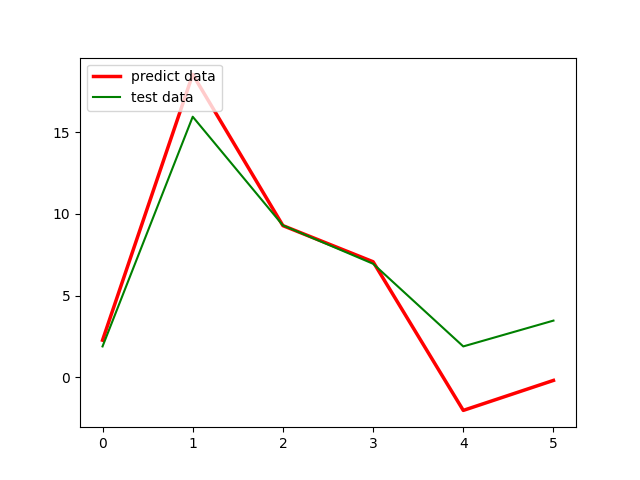

# MCM2021A
MCM2021 Problem A code : Fungi decomposition model based on cellular automata

## Our Work
Our purpose is to study the mutual influence of multiple fungi when they exist simultaneously and the influence of the external environment on the survival and decomposition of fungi. To make accurate and reasonable predictions, we have established three models: model I: Fungi interaction model under unchanging environment, model II: Fungi interaction model under changing environment and model III: Decomposition rate model. 

## Our Model

### Test on Decomposition Model
For model I, we simulate the changing process of each fungal population based on the cellular automata model when the environmental conditions are suitable and unchanged in the short term. First, we analyze the determinants of the competitive ability of strains, establish the probability mapping relationship between the relative competitive ability of each fungus and occupying the grid position, and formulate the grid state transformation rules. We design fungal parameters with different extension rates and use computer software to simulate population changes. We find that under unchanged and suitable environmental conditions, fast-growing fungi have an advantage in evolution in the short term. 

### Cellular Automata Model
. Our model verifies the influence of the environment on the succession of fungi:environmental changes may change types of dominant strains, enhance the relative competitiveness of strains with strong tolerance to environmental changes, and weaken the relative competition of strains with poor resistance to environmental changes. Additionally, we
test the sensitivity of the model to temperature, humidity, fungal extension rate, moisture tolerance and high temperature resistance. It is found that the model is more sensitive to changes in fungal extension rate, humidity resistance and high temperature resistance, while it is more consistent with the real situation.

## Model III
For model III, to quantitatively describe the decomposition rate of each strain, we apply a mixed linear regression equation to establish the relationship between the decomposition rate and the extension rate and moisture tolerance. Combining with Model II, we calculate the total
decomposition efficiency in a certain system and analyze the effect of fungal species on the decomposition efficiency. Finally, we predict the importance and role of biodiversity based on our three models.

